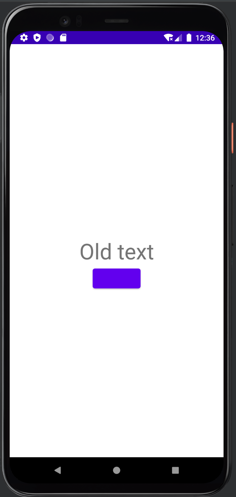

# Ваш первый тест на Kaspresso

Начнем с написания теста на простой экран:



Экран состоит из:
- Заголовка `TextView`
- Поля ввода `EditText`
- Кнопки `Button`

При нажатии на кнопку текст в заголовке меняется на введенный в поле ввода.

## Подключаем Kaspresso к проекту

1. Подключаем в файл `build.gradle` проекта репозиторий `mavenCentral`

```groovy
allprojects {
    repositories {
        mavenCentral()
    }
}
```

2. Добавляем зависимость в файл `build.gradle` главного модуля

```groovy
dependencies {
    androidTestImplementation 'com.kaspersky.android-components:kaspresso:<latest_version>'
}
```

Если Вы используете Android Support, мы рекомендуем мигрировать на AndroidX. Последняя поддерживаемая версия для Android Supprot:

```groovy
dependencies {
    androidTestImplementation 'com.kaspersky.android-components:kaspresso:1.0.1-support'
}
```

## Написание теста начнем с создания Page object для текущего экрана.
В папке `androidTest` создаем объект `SimpleScreen`

```kotlin
object SimpleScreen : KScreen<SimpleScreen>() {

    override val layoutId: Int = R.layout.activity_simple
    override val viewClass: Class<*> = SimpleActivity::class.java

    val title = KButton { withId(R.id.simple_title) }
    val button = KButton { withId(R.id.change_title_btn) }
    val input = KEditText { withId(R.id.input_text) }
}
```
В этом объекте мы описываем элементы интерфейса, с которым будет взаимодействовать тест. Здесь стоит обратить внимание на то, что мы один раз кладем matcher-ы в конструктор `View`. В самом тесте мы сможем обращаться к SimpleScreen и его элементам напрямую.
Контрукция с matcher-ами может быть более сложная. Например, если у какого-то элемента нет `id`, мы можем найти его с помощью нескольких matcher-ов.

## Приступаем с коду самого теста
```kotlin
class SimpleTest : TestCase() {

    @get:Rule
    val activityRule = activityScenarioRule<SimpleActivity>()

    @Test
    fun test() {
        SimpleScreen {
            title {
                isVisible()
                hasText(R.string.simple_activity_default_title)
                hasTextColor(R.color.black)
            }

            button {
                isVisible()
                withText(R.string.simple_activity_change_title_button)
                isClickable()
            }
            input {
                isVisible()
                hasHint(R.string.simple_activity_input_hint)
                hasEmptyText()

                typeText("Kaspresso")
                hasText("Kaspresso")
            }
            closeSoftKeyboard()
            button {
                click()
            }
        }
    }
}
```


Благодаря Page object код становится деклоративным и понятным.


