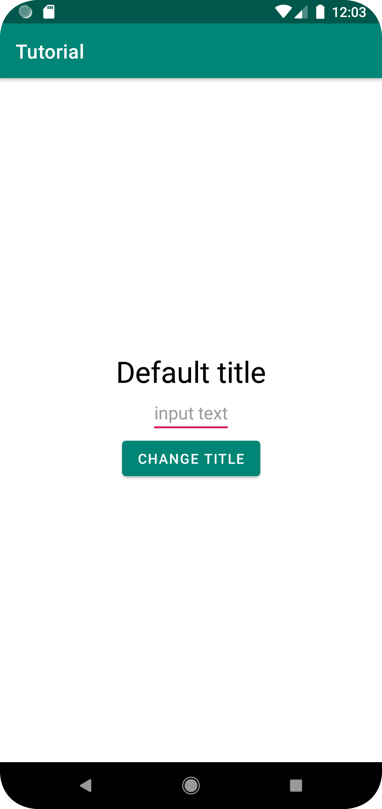

# Ваш первый тест на Kaspresso

Начнем с написания теста на простой экран:



Экран состоит из:
- Заголовка `TextView`
- Поля ввода `EditText`
- Кнопки `Button`

При нажатии на кнопку текст в заголовке меняется на введенный в поле ввода.

## Подключаем Kaspresso к проекту

1. Подключаем в файл `build.gradle` проекта репозиторий `mavenCentral`

```groovy
allprojects {
    repositories {
        mavenCentral()
    }
}
```

2. Добавляем зависимость в файл `build.gradle` главного модуля

```groovy
dependencies {
    androidTestImplementation 'com.kaspersky.android-components:kaspresso:<latest_version>'
}
```

Если Вы используете Android Support, мы рекомендуем мигрировать на AndroidX. Последняя поддерживаемая версия для Android Supprot:

```groovy
dependencies {
    androidTestImplementation 'com.kaspersky.android-components:kaspresso:1.0.1-support'
}
```

## Написание теста начнем с создания Page object для текущего экрана.
В папке `androidTest` создаем объект `SimpleScreen`

```kotlin
object SimpleScreen : KScreen<SimpleScreen>() {

    override val layoutId: Int = R.layout.activity_simple
    override val viewClass: Class<*> = SimpleActivity::class.java

    val title = KButton { withId(R.id.simple_title) }
    val button = KButton { withId(R.id.change_title_btn) }
    val input = KEditText { withId(R.id.input_text) }
}
```
В этом объекте мы описываем элементы интерфейса, с которым будет взаимодействовать тест. Здесь стоит обратить внимание на то, что мы один раз кладем matcher-ы в конструктор `View`. В самом тесте мы сможем обращаться к SimpleScreen и его элементам напрямую.
Контрукция с matcher-ами может быть более сложная. Например, если у какого-то элемента нет `id`, мы можем найти его с помощью нескольких matcher-ов. 

## Приступаем с коду самого теста
```kotlin
class SimpleTest : TestCase() {

    @get:Rule
    val activityRule = activityScenarioRule<SimpleActivity>()

    @Test
    fun test() {
        SimpleScreen {
            title {
                isVisible()
                hasText(R.string.simple_activity_default_title)
                hasTextColor(R.color.black)
            }

            button {
                isVisible()
                withText(R.string.simple_activity_change_title_button)
                isClickable()
            }
            input {
                isVisible()
                hasHint(R.string.simple_activity_input_hint)
                hasEmptyText()

                typeText("Kaspresso")
                hasText("Kaspresso")
            }
            closeSoftKeyboard()
            button {
                click()
            }
            title {
                hasText("Kaspresso")
            }
        }
    }
}
```

Сперва SimpleTest был отнаследован от TestCase. Это не единственный способ создать тестовый класс. В случае, когда невозможно отнаследоваться от TestCase, можно использовать TestCaseRule. 
```kotlin
 @get:Rule
 val testCaseRule = TestCaseRule(javaClass.simpleName)
```
В этом случае тело тестового метода должно начинаться с обращения к этому инстансу:
```kotlin
@Test
fun test() =
  testCaseRule.run {
      ...  
  }
```

Рассмотрим сам тест. Благодаря реализации паттерна Page object и Kotlin DSL код теста становится простым и понятным: сперва мы проверили корректность отображения нужных элементов, затем ввели текст в поле ввода, нажали кнопку и проверили, что заголовок изменился. Однако, код любого теста - это реализация определенных тест-кейсов. Сам же тест-кейс - некий сценарий (последовательность шагов), написанный на человеческом языке тестировщиком. Этот набор шагов может со временем меняться, поэтому спустя какое-то время возникнет потребность в редактировании теста. Код должен оставаться понятным спустя долгое время, поэтому он должен быть разделен на шаги, идентичные указанным в тест-кейсах. Комментарии будут не самым лучшим решением, так как в логах не будет понятно, на каком шаге упал тест. Для этого можно воспользоваться специальными методами.

```kotlin
class SimpleTest : TestCase() {

    @get:Rule
    val activityRule = activityScenarioRule<SimpleActivity>()

    @Test
    fun test() =
        before {

        }.after {

        }.run {
            step("Open Simple Screen") {
                SimpleScreen {
                    title {
                        isVisible()
                        hasText(R.string.simple_activity_default_title)
                        hasTextColor(R.color.black)
                    }

                    button {
                        isVisible()
                        withText(R.string.simple_activity_change_title_button)
                        isClickable()
                    }
                    input {
                        isVisible()
                        hasHint(R.string.simple_activity_input_hint)
                        hasEmptyText()
                    }
                }
            }

            step("Type \" Kaspresso \"") {
                SimpleScreen {
                    input.typeText("Kaspresso")
                    closeSoftKeyboard()
                    button.click()
                }
            }

            step("Check title content") {
                SimpleScreen {
                    title.hasText("Kaspresso")
                }
            }
        }
}
```
Секции before и after нужны для настройки состояния до и после прогона теста. Например, это может быть включение Bluetooth. До выполнения теста необходимо включить его, а после - выключить. Более подробно будет описано в следующих примерах. 


